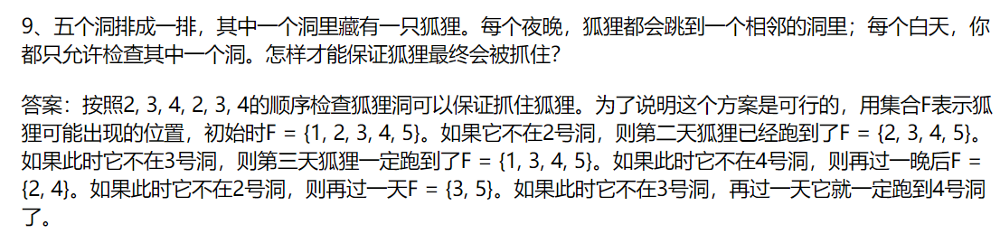

# TPLINK一面嵌入式软件工程师

1. define和const的区别？

2. 堆和栈的区别？

3. 内存模型？局部变量、全局变量、静态变量、函数的存放位置。

   参考CSAPP。

# TPLINK二面嵌入式软件工程师

1. 智力题：

2. 返回数组中第三大的数，两个数相同视为一个数，若无第三大的数则返回最大的数。
   思路：使用优先级队列，但是需要处理两个数相同的情况。

   ```C++
   #include <iostream>
   #include <algorithm>
   #include <vector>
   using namespace std;
   
   int main()
   {
   	int n;
   	cin >> n;
   	vector<int> nums(n);
   	for (int i = 0; i < n; ++i)
   	{
   		cin >> nums[i];
   	}
   	int max1 = INT_MIN;	// 最大
   	int max2 = INT_MIN;	// 次之
   	int max3 = INT_MIN;	// 第三大
   	for (int i = 0; i < n; ++i)
   	{
   		vector<int> temp = { max1, max2, max3, nums[i] };
   		sort(temp.begin(), temp.end(), [](int x, int y) {return x > y; });
   		unique(temp.begin(),temp.end());
   
   		max1 = temp[0];
   		max2 = temp[1];
   		max3 = temp[2];
   	}
   	if (max2 == max3 || max3 == INT_MIN)
   		cout << max1;
   	else
   		cout << max3;
   	return 0;
   }
   ```

# TPLINK三面嵌入式软件工程师

1. 自我介绍。
2. 聊项目。
3. 有什么爱好。
4. 反问环节。