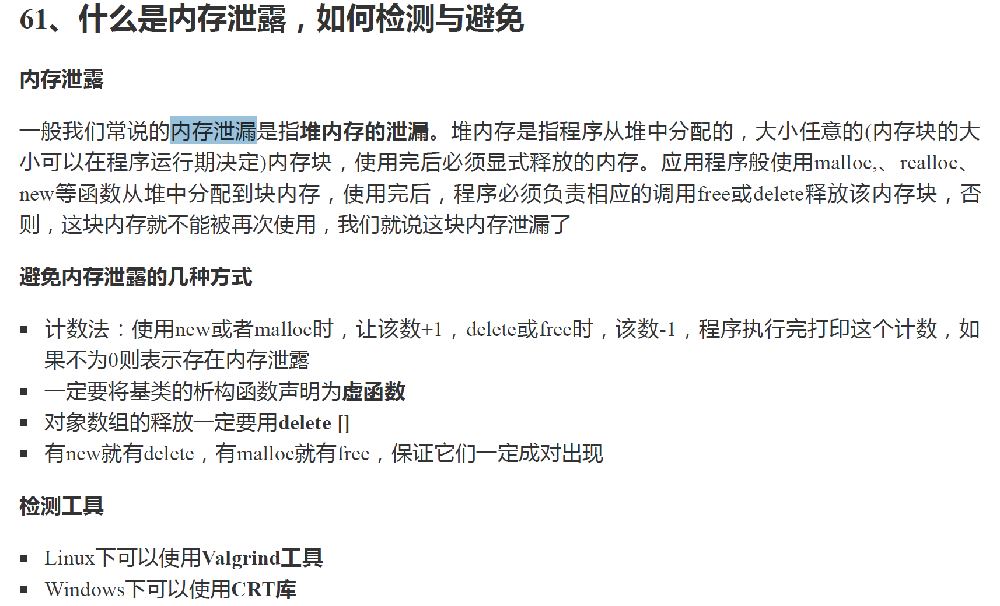
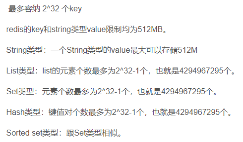
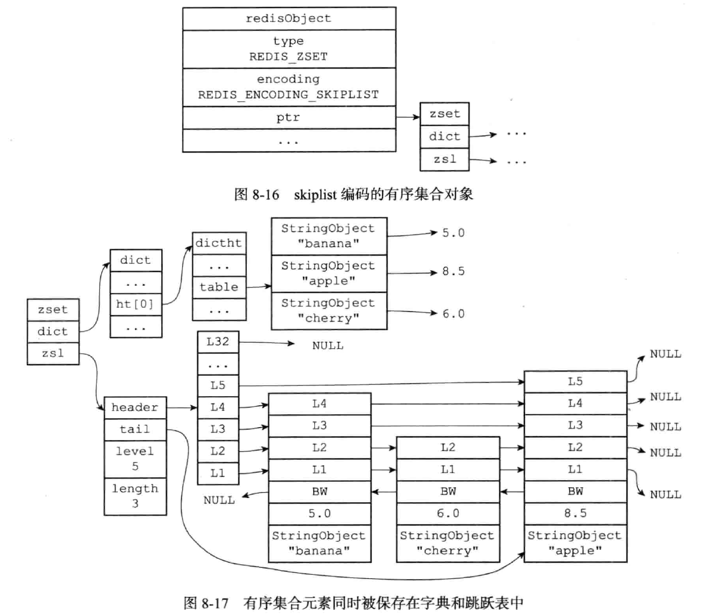

shopee

# 一面

1. 介绍redis的底层数据结构。
   https://www.cnblogs.com/haoprogrammer/p/11065461.html

2. 介绍排序算法的思路和时间复杂度。

3. 大数据和空间限制相关的问题：
   (1)找到两个文件中相同的url。hash table。
   (2)找到两个**很大**的文件中相同的url。布隆过滤器。
   (3)找到很大文件中的第100个数。Top K问题，优先级队列。
   (4)找到很大文件中的中位数。

4. 四次挥手的过程。
   https://blog.csdn.net/imilli/article/details/50620104

5. 客户端收到服务端的FIN信号后处于什么状态。TIME_WAIT状态。

6. 2MSL存在的原因。
   (1)ACK丢失，那么服务器端会重发FIN报文，客户端的TIME_WAIT状态用来重发ACK报文。
   (2)使得本次连接产生的数据段从网络消失，从而保证关闭连接后不会有还在网络中滞留的数据段去骚扰客户端。再有一点就是，如果客户端重新发送请求，如果前一次连接的某些数据仍然滞留在网络中，这些延迟数据在建立新连接之后才到达Server，由于新连接和老连接的端口号是一样的，又因为TCP协议判断不同连接的依据是socket pair，于是，TCP协议就认为那个延迟的数据是属于新连接的，这样就和真正的新连接的数据包发生混淆了。
   https://blog.csdn.net/Q846169253/article/details/82217910

7. 算法题目

   ```java
   找最大正方形的面积
   
   详细描述
   
   在一个由 0 和 1 组成的二维矩阵内，找到只包含 1 的最大正方形，返回其面积
   
   输入输出描述
   
   输入描述
   
   1 0 1 0 0
   
   1 0 1 1 1 
   
   1 1 1 1 1 
   
   1 0 0 1 0
   
   输出描述
   
   只包含1的最大正方形，面积为 2 * 2 =4 
   
   备注
   
   class Solution {
   
      public static void main(String[] args) {
   
          char[][] matrix = {
   
              {'1','0','1','0','0'},
   
              {'1','0','1','1','1'},
   
              {'1','1','1','1','1'},
   
              {'1','0','0','1','0'}
   
          };
   
          System.out.print(maximalSquare(matrix));
   
      }
   
      public static int maximalSquare(char[][] matrix) {
   
          //待实现
   
      }
   
   }
   ```

   使用动态规划实现，以dp\[i][j]为正方形右下角，保存内部含正方形的最大边长度。那么动态规划的公式如下：
   $$
   dp[i][j]=
   \begin{cases}
   0,& \text{matrix[i][j]=0}\\
   min\{dp[i-1][j-1], dp[i-1][j],dp[i][j-1]\},& \text{matrix[i][j]=1}
   \end{cases}
   $$

   ```c++
   #include <vector>
   using namespace std;
   
   int maximalSquare(vector<vector<int>>& matrix)
   {
       if (matrix.empty())
           return 0;
       int m = matrix.size();
       int n = matrix[0].size();
       
       vector<vector<int>> dp(matrix);
   
       int res = INT_MIN;
       for (int i=0;i<m;++i)
           res = max(dp[i][0], res);
       for (int i=0;i<n;++i)
           res = max(dp[0][i], res);
       for (int i=1;i<m;++i)
       {
           for (int j=1;j<n;++j)
           {
               if (matrix[i][j] == 0)
                   continue;
               else
               {
                   dp[i][j] = min(dp[i-1][j], min(dp[i-1][j-1], dp[i][j-1])) + 1;
                   res = max(res, dp[i][j]);
               }
           }
       }
       if (res == INT_MIN)
           return 0;
       return res*res;
   }
   ```

# 二面

1. 讲一讲WebServer用到的socket函数。这个我听错了，说我不知道，下来才想起来是问这个。

2. n个同学，对分数进行排序。

   > 使用`计数排序`。时间复杂度O(n)。

3. 如果有小数怎么办？

   > 分段再排序。时间复杂度还是O(nlgn)。

4. 给一个单链表和一个指定的节点指针，不知道这个链表的头和尾，如何删除这个节点？

   > 把后面的链表节点复制到前面，然后删除最后一个节点。

5. TCP/IP连接时粘包，如何在服务端拆包？

   > https://network.51cto.com/art/201910/604438.htm 
   > 其实是需要在应用层去解决的一个问题罢了，需要做好应用层解析的协议。
   > a.定长协议，不足补0；
   > b.特殊字符分割协议，在包尾部增加回车或者空格等特殊字符进行分割；
   > c.变长协议，将消息分为消息头和消息尾部，还可以尾部增加CRC校验；
   > d.序列化。

6. core dump

   > https://blog.csdn.net/qq_20553613/article/details/106672319
   >  一个coredump文件主要包含了应用程序的内存信息、寄存器状态、堆栈地址、函数调用上下文，开发人员通过分析这些信息，确定程序异常发生时的调用位置，如果是堆栈溢出，还需分析多层函数的调用信息。

7. 内存泄漏，垃圾cpp，淦
   

8. redis key的最大长度
   

9. redis zset

   > 底层是哈希表和跳跃表。详见Redis设计与实现。
   >
   > 

10. 手撕代码：Three Sum

    > 转化为TwoSum的问题解决。

