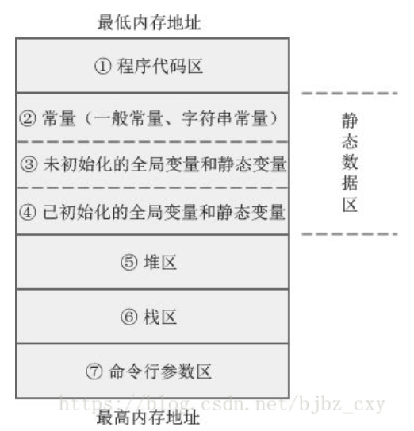

时长25min。

1. 介绍项目。
2. 堆和栈的区别？
   答：http://blog.chinaunix.net/uid-26868581-id-3328648.html   栈调用函数的过程：函数的参数从右到左先压入栈，然后是返回地址，接着是压入栈底指针rbp的值，将此时rbp的值赋给rsp，rbp减去n个字节（给局部变量分配内存空间），函数体，最后是出栈。C语言内存分配模型：栈、堆、静态数据存储区、代码区。
   
3. C++中容器有哪些？
   答：vector、list、deque、map、unordered_map、set、unordered_set、stack、queue、priority_queue
4. 容器分为哪两类？
   答：序列式容器：vector(向量)、list(双链表)、deque(双端队列)、stack、queue、priority_queue；关联式容器：set、map、unordered_set、unordered_map。blog：https://blog.csdn.net/try_again_later/article/details/98040699
5. 容器配接器
   答：stack、queue、priority_queue。默认情况下，`stack` 和 `queue` 是基于 `deque` 实现的，`priority_queue` 是在 `vector` 之上实现的。