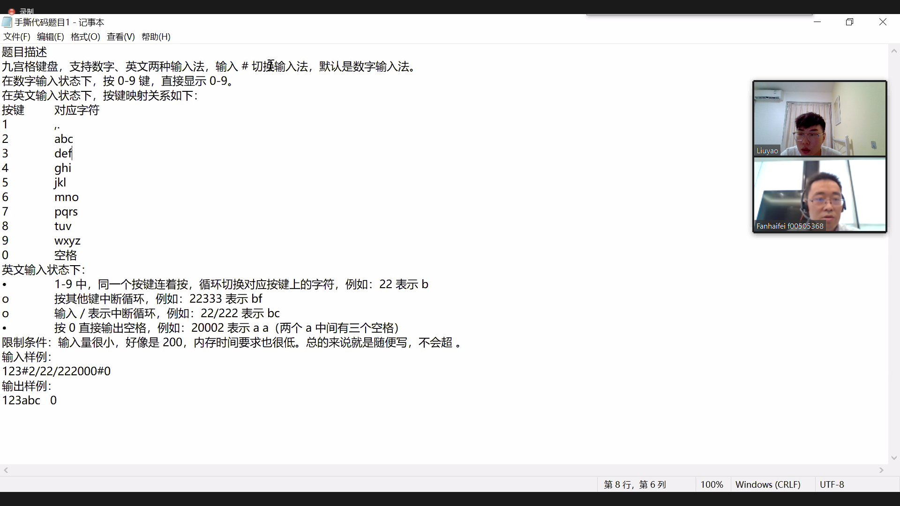

# 华为软开一面 20210719

1. 算法题目
   这个题目还是蛮麻烦的，需要考虑一些细节：（1)字符串解析；（2)九宫格模式下'/'分割；（3)特例：九宫格模式下99999打印出来是zw，需要模除来判断。写完之后，华为的面试官让我将思路给他听，然后带着一起看代码。修修改改一些细节，中间在不断跟面试官交流，让他明白自己的思路和考虑，同时也将他的一些意见补充进代码里。
2. 介绍了自己大四在机器人团队做嵌入式软件组组长的一些工作。
3. 反问环节：
   （1）华为终端芯片业务部具体做什么东西？
   （2）技术栈有哪些？
   （3）能给我一些学习上的建议嘛？

# 华为软开二面20210722

讲项目，写题目。

# 华为软开主管面20210809

讲项目。
