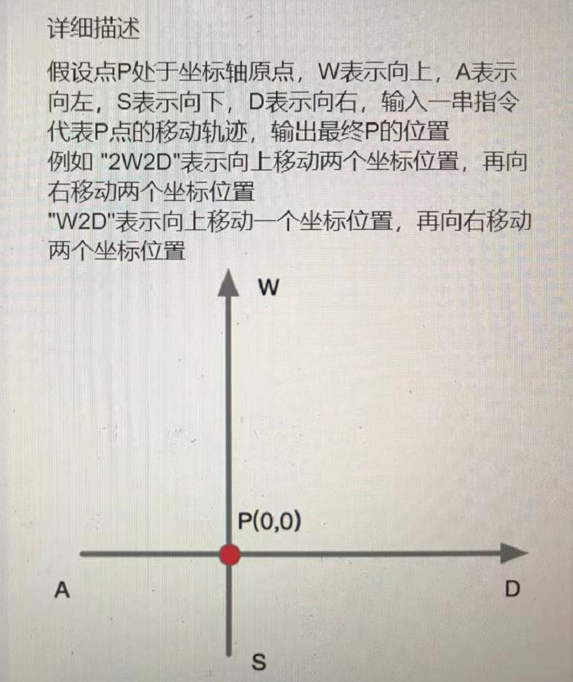
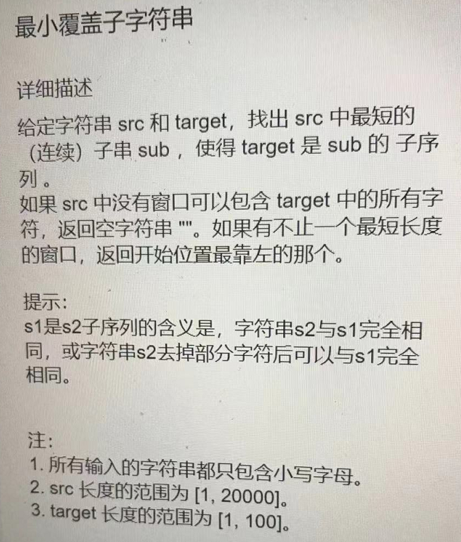
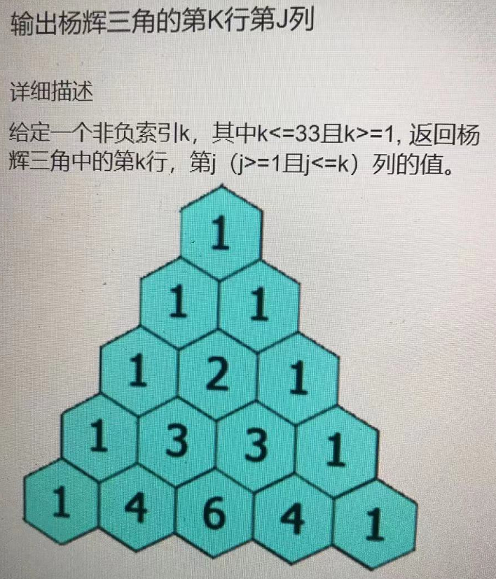

# Shopee 后端开发7.19日笔试题

## 第一题 

* 输入：“2W2D“，输出：[2,2]

* 坑：要考虑输入AWSD和awsd，输入存在小写的情况

* 代码如下：

  ~~~C++
  // AC 100%
  vector<int> GetEndPoint(string order) {
      // write code here
      int len = order.size();
      int t = 0;
      int x=0, y=0;
      for(int i=0; i<len; i++){
          if(order[i]>='0' && order[i]<='9'){
              t = t*10 + order[i]-'0';
          }else{
              if(order[i]=='A' || order[i]=='a'){
                  if(t==0){
                      x -= 1;
                  }else{
                      x -= t;
                  }
              }else if(order[i]=='S' || order[i]=='s'){
                  if(t==0) y-=1;
                  else y -= t;
              }else if(order[i]=='D' || order[i]=='d'){
                  if(t==0) x+=1;
                  else x += t;
              }else{
                  if(t==0) y += 1;
                  else y += t;
              }
              t = 0;
          }
      }
      return {x, y};
  }
  ~~~

  

## 第二题

* 输入：”abcd","bc" 输出："bc"

* 代码如下：

  ~~~C++
  // 滑动窗口：AC 90%
  // 先找到所有满足覆盖要求的区间，然后找到最小的区间长度返回这一段区间
  string findMinOverrideSubString(string source, string target) {
      int len = source.size(), sublen = target.size();
      if(len < sublen) return "";
      int l = 0, r = 0;
      vector<pair<int, int>> win; 
      while(r < len){
          int i = 0;
          bool first = true;
          int cur_l = l;
          for(;i < sublen;){
              if(r>=len) break;
              if(target[i] == source[r]){
                  if(first){
                      cur_l = r; first = false;
                  }
                  r++;
                  i++;
              }else{
                  r++;
              }
          }
          if(i == sublen){
              win.push_back({cur_l, r-1});
          }
          if(cur_l!=l){
              l = cur_l;
              r = l+1;
          }else{
              break;
          }
      }
      if(win.size() == 0) return "";
      int minlen = 1e9;
      string res;
      for(auto x:win){
          int t_t = x.second - x.first + 1;
          if(t_t < minlen){
              string t;
              for(int i=x.first; i<=x.second; i++){
                  t += source[i];
              }
              res = t;
              minlen = t_t;
          }
      } 
      return res;
  }
  ~~~

  

## 第三题

* lc原题，比较简单的动态规划，最左最右不累加，其他位置都需要状态转移

* 输入：1，1 输出：1。（输入行数和列数都是从1开始的）

* 代码如下：

  ~~~C++
  // AC 100%
  int getValue(int rowIndex, int columnIndex) {
      vector<int> res(rowIndex, 1); // 一维dp数组
      if(rowIndex <= 1) return 1;
      for(int i=1; i<rowIndex; i++){
          for(int j=i-1; j>0; j--){
              res[j] += res[j-1];
          }
      }
      return res[columnIndex-1];
  }
  ~~~

  

