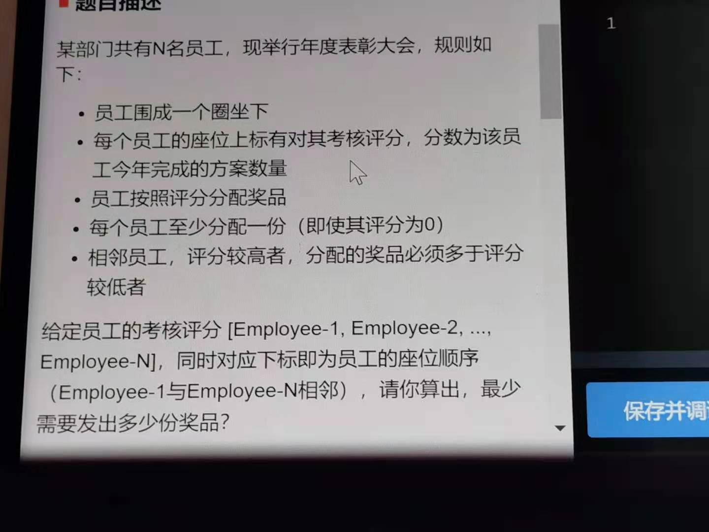
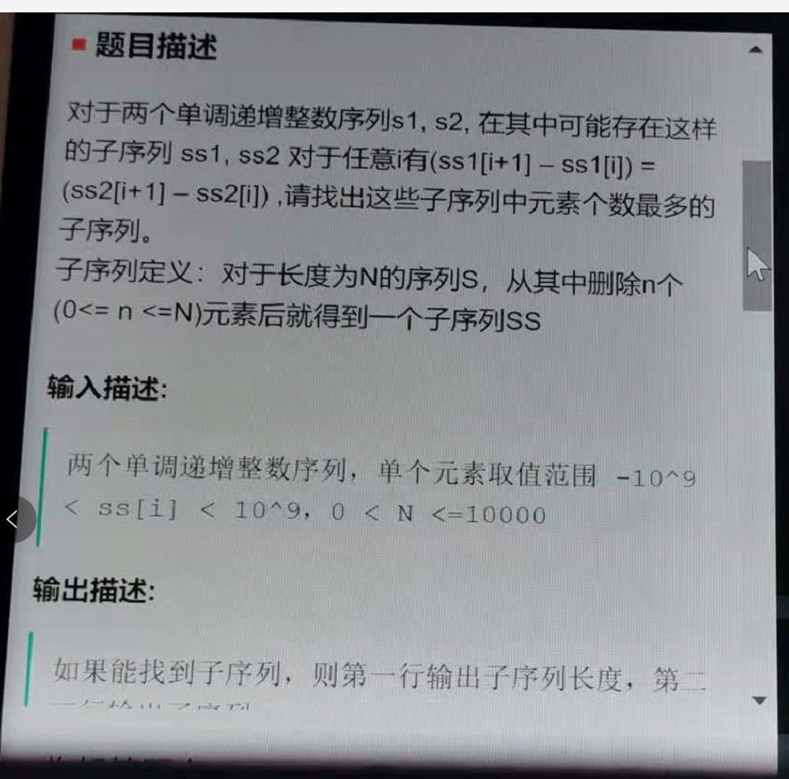
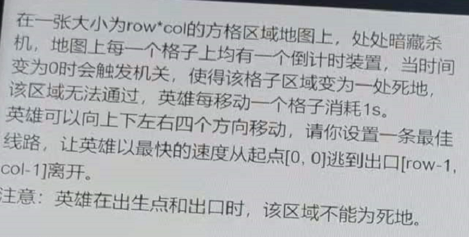
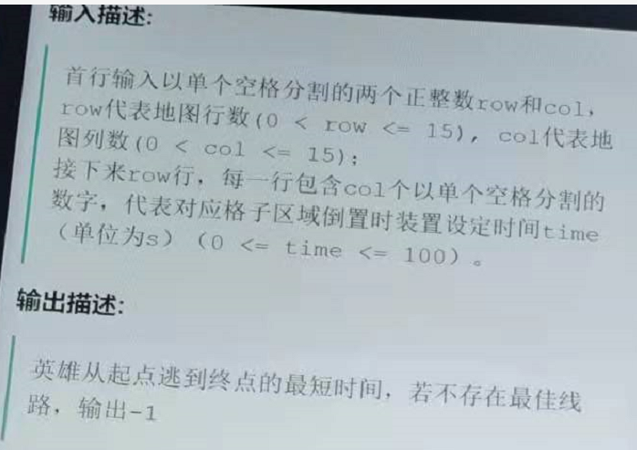
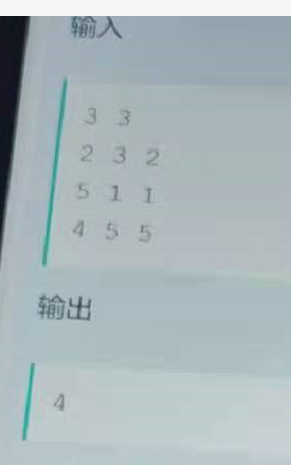

# 时间2021/6/30

1. 

   > 参考leetcode135题 hard，贪心思想

   输入：第一行为为员工数量N(1\<=N\<=1000),第二行为每位员工的考核评分

   输出：最少需要发出的礼品份数

   测试样例：3 / 1 0 2 =>6     5 / 9 45 86 51 3 =>12

   **思路：**

   	* 注意与原题的不同，这里是环形数组的表达，数组首位和末尾是相邻的
    *  原题贪心思想借用一下
         	* 先找到数组中最小的数（评分最低），过程中给每个员工都发一份奖品
            
               	* 从最小数的位置i开始，往右遍历，下一位比本位评分高，就给下一位+1（多发一份奖品），一直到回到i
         	
         	* 从最小数的位置i开始，往左遍历，下一位比本位评分高，就给下一位+1（多发一份奖品），一直到回到i。输出最终结果

   **代码：**

   ~~~C++
   
   
   
   ~~~

   

2. 

   ​	

   > 无参考

   输出要求：第一行输出子序列长度，第二、三行给出子序列(<font color=red>注意要给出两个子序列</font>)

   测试样例：1 2 3 4 5 \n 2 4 6 8 =>3 \n 1 3 5 \n 2 4 6     1 2 3 4 5 \n 2 7 12 17 => 0

   **思路：**

    * 感觉数据范围是DP，但是想不出来，可能思考错误了

   **代码：**

   ~~~C++
   
   
   ~~~

   

3. 

   

   

   > 参考经典BFS，增加一些状态更新的处理即可

   输出要求：第一行输出子序列长度，第二、三行给出子序列(<font color=red>注意要给出两个子序列</font>)

   测试样例：1 2 3 4 5 \n 2 4 6 8 =>3 \n 1 3 5 \n 2 4 6     1 2 3 4 5 \n 2 7 12 17 => 0

   **思路：**

    * BFS，不走回头路，并且判断下一步是不是死地

   **代码：**

   ~~~C++
   #include <iostream>
   #include <vector>
   #include <queue>
   #include <algorithm>
   using namespace std;
   
   int row, col;
   
   int dx[4] = {0,1,0,-1};
   int dy[4] = {1,0,-1,0};
   
   int main(){
       cin>>row>>col;
       if(row==1 && col==1){
           cout<<0;
           return 0;
       }
       vector<vector<int>> map(row, vector<int>(col, 0));
       vector<vector<int>> visited(row, vector<int>(col, 0));
       for(int i=0; i<row; i++){
           for(int j=0; j<col; j++){
               cin>>map[i][j];
           }
       }
       queue<pair<int, int>> q;
       q.push({0,0});
       visited[0][0] = 1;
       int cnt = 1;
       while(!q.empty()){
           int size = q.size();
           for(int t=0; t<size; t++){
               auto cur = q.front();
               q.pop();
               for(int i=0; i<4; i++){
                   int x = cur.first + dx[i];
                   int y = cur.second + dy[i];
                   if(x<0 || x>=row || y<0 || y>=col) continue;
                   if(x==row-1 && y==col-1){
                       cout<<cnt;
                       return 0 ;
                   }
                   if(map[x][y]-cnt >=0 && visited[x][y]==0){
                       map[x][y] -= cnt;
                       visited[x][y] = 1;
                       q.push({x,y});
                   }
               }
           }
           cnt++;
       }
       cout<<-1;
       return 0;
   }
   ~~~

# 时间2021/7/8

From 牛客网：[灯火微凉。](https://www.nowcoder.com/profile/1292214) 题目拍照以及用例存放在image/华为20210708。

1.有n个事件，每个事件形式为(t,w),表示若在t时刻前完成该事件，获得w分数，每一个小时只能完成一个事件，求最大能获得的分数

事件数量<=1000000。从后往前贪心 找到最大分值的任务并完成 tips:用long long类型存结果的最后得转int（数据应该是有点问题）


```C++
#include <algorithm>
#include <cassert>
#include <cmath>
#include <cstdio>
#include <cstdlib>
#include <cstring>
#include <ctime>
#include <iostream>
#include <map>
#include <queue>
#include <set>
#include <stack>
#include <unordered_map>
#include <vector>
#define fir first
#define se second
#define ll long long
#define pb push_back
#define mp make_pair
#define ull unsigned long long
#define cl(a, b) memset(a, b, sizeof(a))
#define quickio(a) ios::sync_with_stdio(a)
#define datatest() freopen("data.in", "r", stdin)
#define makeans() freopen("data.out", "w", stdout)
#define makedata() freopen("data.in", "w", stdout)
#define pii pair<int, int>
#define pll pair<ll, ll>
#define pdd pair<double, double>
using namespace std;
const int maxn = 1e6 + 10;
const int maxm = 1e6 + 10;
const int inf = 0x3f3f3f3f;
const ll mod = 1e9 + 7;
const int maxblock = sqrt(maxn) + 10;
const double eps = 1e-7;
const ll INF = 1e16;
int n;
pair<int, ll> p[maxn];
int cmp(pair<int, ll> &a, pair<int, ll> &b) {
  if (a.first != b.first)
    return a.first < b.first;
  else
    return a.second > b.second;
}
priority_queue<ll> pq;
int main() {
  quickio(0);
  cin >> n;
  for (int i = 1; i <= n; i++) {
    cin >> p[i].first >> p[i].second;
    assert(p[i].first>0);
    assert(p[i].first<=1000000);
    assert(p[i].second > 0);
  }
  sort(p + 1, p + n + 1, cmp);
  ll res = 0;
  int cur = n;
  for (int t = 1000000; t >= 1; t--) {
    while (cur >= 1 && p[cur].first >= t) {
      if (p[cur].second > 0) {
        pq.push(p[cur].second);
      }
      cur--;
    }
    if (!pq.empty()) {
      ll top = pq.top();
      res += top;
      pq.pop();
    }
  }
  cout << (int)res << endl;

  return 0;
}
```

2.给定一个有向图以及一个起点，问是否只从起点出发就可以走到全部的点，如果可以，输出起点到其他点的最长距离 

  点数<=100 边数<=5000 

  floyd求最长路然后判断找到最长路经就可以 最恶心的是输入


```c++
#include <algorithm>
#include <cmath>
#include <cstdio>
#include <cstdlib>
#include <cstring>
#include <ctime>
#include <iostream>
#include <map>
#include <queue>
#include <set>
#include <stack>
#include <unordered_map>
#include <vector>
#define fir first
#define se second
#define ll long long
#define pb push_back
#define mp make_pair
#define ull unsigned long long
#define cl(a, b) memset(a, b, sizeof(a))
#define quickio(a) ios::sync_with_stdio(a)
#define datatest() freopen("data.in", "r", stdin)
#define makeans() freopen("data.out", "w", stdout)
#define makedata() freopen("data.in", "w", stdout)
#define pii pair<int, int>
#define pll pair<ll, ll>
#define pdd pair<double, double>
using namespace std;
const int maxn = 1e6 + 10;
const int maxm = 1e6 + 10;
const int inf = 0x3f3f3f3f;
const ll mod = 1e9 + 7;
const int maxblock = sqrt(maxn) + 10;
const double eps = 1e-7;
const ll INF = 1e16;
vector<vector<int>> edge;
int n, s;
void ParseString(string &str) {
  int e[3];
  cl(e, 0);
  int num = 0;
  int sz = str.size();
  for (int i = 1; i < sz - 1; i++) {
    if (str[i] == ',')
      num++;
    else {
      e[num] = e[num] * 10 + str[i] - '0';
    }
  }
  vector<int> temp{e[0], e[1], e[2]};
  edge.emplace_back(temp);
}
vector<int> g[200];
int w[200][200];
int f[200][200];
int vis[200];
int dfs(int u) {
  vis[u] = 1;
  for (auto &v : g[u]) {
    if (vis[v] == 1) continue;
    dfs(v);
  }
}
map<int, int> ma;
int main() {
  std::string str;
  int cnt = 0;
  while (cin >> str) {
    if (str[0] != '[') {
      if (cnt == 0) {
        n = stoi(str.c_str());
      } else {
        s = stoi(str.c_str());
      }
      cnt++;
    } else {
      ParseString(str);
    }
  }

  cl(f, inf);
  int cnt1 = 0;
  for (auto &it : edge) {
    int u = it[0], v = it[1], W = it[2];
    if (!ma.count(u)) {
      ma[u] = ++cnt1;
    }
    if (!ma.count(v)) {
      ma[v] = ++cnt1;
    }
  }
  s = ma[s];
  for (auto &it : edge) {
    int u = ma[it[0]], v = ma[it[1]], W = it[2];
    g[u].push_back(v);
    f[u][v] = min(f[u][v], -1 * W);
  }

  for (int i = 1; i <= n; i++) f[i][i] = 0;
  //dfs(s);
  int num0 = 0;
  if (num0) {
    printf("-1\n");
    return 0;
  }
  for (int k = 1; k <= n; k++) {
    for (int i = 1; i <= n; i++) {
      for (int j = 1; j <= n; j++) {
        f[i][j] = min(f[i][j], f[i][k] + f[k][j]);
      }
    }
  }
  for (int i = 1; i <= n; i++) num0 += (f[s][i] > 0);
  if (num0 > 0) {
    printf("-1\n");
    return 0;
  }
  int Max = 0;
  for (int i = 1; i <= n; i++) {
    Max = min(Max, f[s][i]);
  }

  printf("%d\n", -1 * Max);

  return 0;
}
```

3.二维网格图上给定一个起点一个终点，点的前进规则与中国象棋的马前进方式相同，问从起点到达终点的最小距离

地图长宽均<=150

普通的bfs即可


```C++
#include <algorithm>
#include <cmath>
#include <cstdio>
#include <cstdlib>
#include <cstring>
#include <ctime>
#include <iostream>
#include <map>
#include <queue>
#include <set>
#include <stack>
#include <unordered_map>
#include <vector>
#define fir first
#define se second
#define ll long long
#define pb push_back
#define mp make_pair
#define ull unsigned long long
#define cl(a, b) memset(a, b, sizeof(a))
#define quickio(a) ios::sync_with_stdio(a)
#define datatest() freopen("data.in", "r", stdin)
#define makeans() freopen("data.out", "w", stdout)
#define makedata() freopen("data.in", "w", stdout)
#define pii pair<int, int>
#define pll pair<ll, ll>
#define pdd pair<double, double>
using namespace std;
const int maxn = 1e6 + 10;
const int maxm = 1e6 + 10;
const int inf = 0x3f3f3f3f;
const ll mod = 1e9 + 7;
const int maxblock = sqrt(maxn) + 10;
const double eps = 1e-7;
const ll INF = 1e16;
int n, m;
char str[200][200];
int legal(int x, int y, int n, int m) {
  if (x >= 1 && x <= n && y >= 1 && y <= m) return 1;
  return 0;
}
int vis[200][200];
int dis[200][200];
int dx[8] = {-2, -2, 2, 2, -1, -1, 1, 1};
int dy[8] = {-1, 1, -1, 1, -2, 2, -2, 2};
int footx[8] = {-1, -1, 1, 1, 0, 0, 0, 0};
int footy[8] = {0, 0, 0, 0, -1, 1, -1, 1};
int main() {
  scanf("%d %d", &n, &m);
  for (int i = 1; i <= n; i++) {
    scanf("%s", str[i] + 1);
  }
  pair<int, int> s, t;
  for (int i = 1; i <= n; i++) {
    for (int j = 1; j <= m; j++) {
      if (str[i][j] == 'H') {
        s = {i, j};
      }
      if (str[i][j] == 'T') {
        t = {i, j};
      }
    }
  }
  vis[s.first][s.second] = 1;
  queue<pair<int, int>> q;
  q.push(s);
  cl(dis, inf);
  dis[s.first][s.second] = 0;
  while (!q.empty()) {
    auto u = q.front();
    q.pop();
    int x = u.first, y = u.second;
    for (int i = 0; i < 8; i++) {
      int xx = x + dx[i];
      int yy = y + dy[i];
      if (legal(xx, yy, n, m) && !vis[xx][yy] && (str[xx][yy] != '#')) {
        int fx = x + footx[i];
        int fy = y + footy[i];
        if (legal(fx, fy, n, m) && str[fx][fy] == '#') {
          continue;
        }
        dis[xx][yy] = dis[x][y] + 1;
        vis[xx][yy] = 1;
        q.push(mp(xx, yy));
      }
    }
  }
  if (dis[t.first][t.second] == inf)
    printf("-1\n");
  else
    printf("%d\n", dis[t.first][t.second]);
  return 0;
}
```

