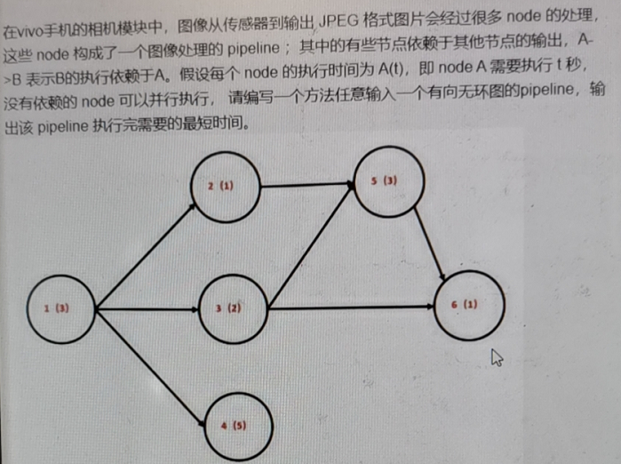

# TPLink

**TPLink提前批，投递职位为嵌入式软件开发工程师。**

1. LeetCode 4.寻找两个正序数组的中位数：https://leetcode-cn.com/problems/median-of-two-sorted-arrays/

   使用二分法可以达到O(lg(m+n))的时间复杂度，但是很麻烦。时间复杂度是O(m+n)的解法：

   ```C++
   class Solution {
   public:
       double findMedianSortedArrays(vector<int>& nums1, vector<int>& nums2) {
           int m = nums1.size();
           int n = nums2.size();
           vector<int> num(m+n);
   
           // len为奇数时，中位数为num[len/2];len为偶数时，中位数为(num[len/2]+num[len/2-1])/2
           int index1 = 0;
           int index2 = 0;
           int i = 0;
           int len = m+n;
           while (index1<m && index2<n)
           {
               if (nums1[index1] <= nums2[index2])
                   num[i] = nums1[index1++];
               else
                   num[i] = nums2[index2++];
               ++i;
           }
   
           if (index1 == m)
           {
               for (;i<len;++i)
                   num[i] = nums2[index2++];
           }
           else if (index2 == n)
           {
               for (;i<len;++i)
                   num[i] = nums1[index1++];
           }
   
           if (len%2 == 0)
               return (num[len/2]+num[len/2-1])/2.0;
           return num[len/2];
       }
   };
   ```

   

2. LeetCode 142.环形链表II: https://leetcode-cn.com/problems/linked-list-cycle-ii/solution/linked-list-cycle-ii-kuai-man-zhi-zhen-shuang-zhi-/

   ```c++
   /**
    * Definition for singly-linked list.
    * struct ListNode {
    *     int val;
    *     ListNode *next;
    *     ListNode(int x) : val(x), next(NULL) {}
    * };
    */
   class Solution {
   public:
       ListNode *detectCycle(ListNode *head) {
           ListNode* MeetingNode = meetingNode(head);
           if (MeetingNode == nullptr)
               return nullptr;
           ListNode* temp = head;
           while (temp != MeetingNode)
           {
               temp = temp->next;
               MeetingNode = MeetingNode->next;
           }
           return MeetingNode;
       }
   
       ListNode* meetingNode(ListNode *head)
       {
           if (head == nullptr)
               return head;
           ListNode* pFast = head;
           ListNode* pSlow = head;
           while (pFast->next != nullptr)
           {
               pSlow = pSlow->next;
               pFast = pFast->next;
               if (!(pFast->next))
                   return nullptr;
               else
                   pFast = pFast->next;
               if (pFast == pSlow)
                   return pFast;
           }
           return nullptr;
       }
   };
   ```

# Vivo   

1. vivo团队在年底计划组织一次抽奖活动，助理小v要从团队中选出工号为数字7或者是7的幸运倍数的员工。

   ```C++
   #include <iostream>
   #include <string>
   #include <vector>
   using namespace std;
   
   int main()
   {
   	string str;
   	//cin >> str;
   	int count = 0;
   	while (cin >> str)
   	{
   		// 判断是否含有'7'
   		int n = str.length();
   		int intS = atoi(str.c_str());
   		if (intS % 7 == 0)
   			count++;
   		else
   			for (int i = 0; i < n; i++)
   			{
   				if (str[i] == '7')
   				{
   					count++;
   					break;
   				}
   			}
   	}
   	cout << count;
   	return 0;
   }
   ```

2. 有一艘货轮的最大载重量为C，现在有N个集装箱，编号为0,1,2,...,n-1，每个集装箱的重量为W，对应的货品价值为V，求这艘货轮选择装载哪些集装箱，才能在不超过最大载重的前提下保证装载的货品总价值最大。**（0-1背包问题）**
   输入描述：
   5  // C
   1,2,3,4,5  // W
   10,11,12,10,14  // V
   输出描述：
   23  // 货运总价值

   ```C++
   int main()
   {
   	int C;		// 最大载重量
   	cin >> C;
   	vector<int> dp(C + 1);
   	string W;
   	string V;
   	cin >> W;
   	cin >> V;
   	vector<int> w;
   	vector<int> v;
   	
   	auto getInt = [](vector<int>& num, string& s)
   	{
   		int temp = 0;
   		for (int i = 0; i < s.size(); ++i)
   		{
   			if (s[i] >= '0' && s[i] <= '9')
   			{
   				temp = temp * 10 + (s[i] - '0');
   			}
   			else
   			{
   				num.push_back(temp);
   				temp = 0;
   			}
   		}
   		num.push_back(temp);
   	};
   
   	getInt(w, W);
   	getInt(v, V);
   	for (int i = 0; i < w.size(); ++i)
   	{
   		for (int j = C; j >= w[i]; j--)
   		{
   			dp[j] = max(dp[j], dp[j-w[i]]+v[i]);
   		}
   	}
   	cout << dp[C];
   	return 0;
   }
   ```

3. 
