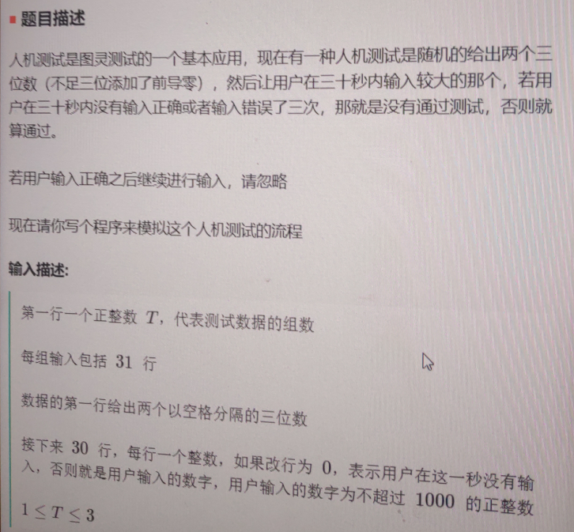
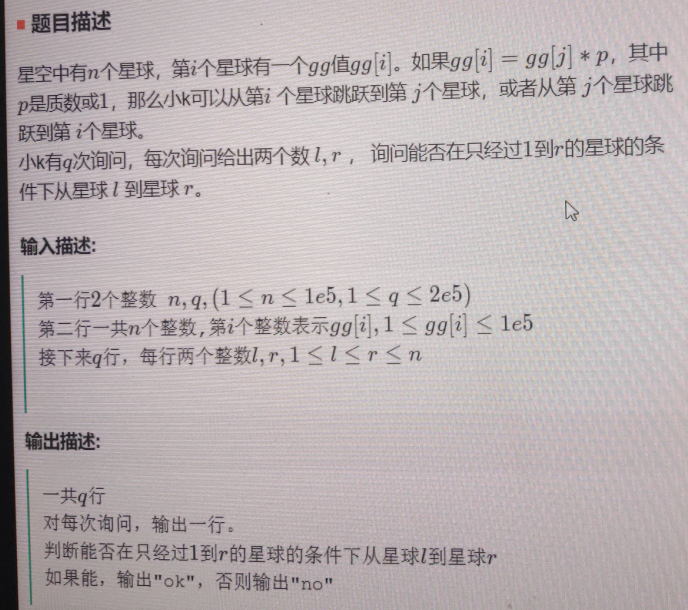

# 2021.8.4

## 第一题

1. 题目描述

   

2. 代码

   ~~~C++
   #include <iostream>
   #include <vector>
   #include <queue>
   #include <stack>
   #include <unordered_map>
   #include <set>
   using namespace std;
   
   int bigOne(int a, int b) {
   	return a > b ? a : b;
   }
   
   int main() {
   	int T;
   	cin >> T;
   	while (T--) {
   		int a, b;
   		cin >> a >> b;
   		int target = bigOne(a, b);
   		int times = 30;
   		int errornum = 3;
   		bool finish = false;
   		for (int i = 0; i < times; i++) {
   			int input;
   			cin >> input;
   			if (!finish) {
   				if (input == target) {
   					cout << "Y" << endl;
   					finish = true;
   				}
   				else if (input == 0)continue;
   				else if (input != 0 && input != target) {
   					errornum--;
   				}
   				if (errornum == 0) {
   					cout << "N" << endl;
   					finish = true;
   				}
   			}
   		}
   	}
   }
   ~~~

   

## 第二题

1. 题目描述

2. 示例

   

3. 代码

   ~~~C++
   #include <iostream>
   #include <vector>
   #include <queue>
   #include <stack>
   #include <unordered_map>
   #include <set>
   using namespace std;
   // 建图不好建，这道题没写出来
   const int N = 1e5;
   int primes[N + 10], cnt;
   bool st[N + 10];
   void get_primes(int n) {
   	for (int i = 2; i <= n; i++) {
   		if (!st[i]) primes[cnt++] = i;
   		for (int j = 0; primes[j] <= n/i; j++) {
   			st[primes[j] * i] = true;
   			if (i % primes[j] == 0) break;
   		}
   	}
   }
   int main() {
   	get_primes(N+10);
   	set<int> hashset;
   	for (int i = 0; i < cnt; i++) {
   		hashset.insert(primes[i]);
   	}
   	hashset.insert(1);
   	int n, q;// n个星球，q次查询
   	cin >> n >> q;
   	vector<int> gg(n);
   	for (int i = 0; i < n; i++) {
   		int a;
   		cin >> a;
   		gg.push_back(a);
   	}
   	vector<vector<int>> graph(n, vector<int>(n, 0));
   	for (int i = 0; i < n; i++) {
   		int cur = gg[i];
   		for (int j = i+1; j < n; j++) {
   			if (graph[i][j] != 0) continue;
   			int val = gg[j] > cur ? gg[j] / cur : cur / gg[j];
   			if (hashset.count(val)) {
   				graph[i][j] = 1;
   				graph[j][i] = 1;
   			}
   		}
   	}
   }
   ~~~

   